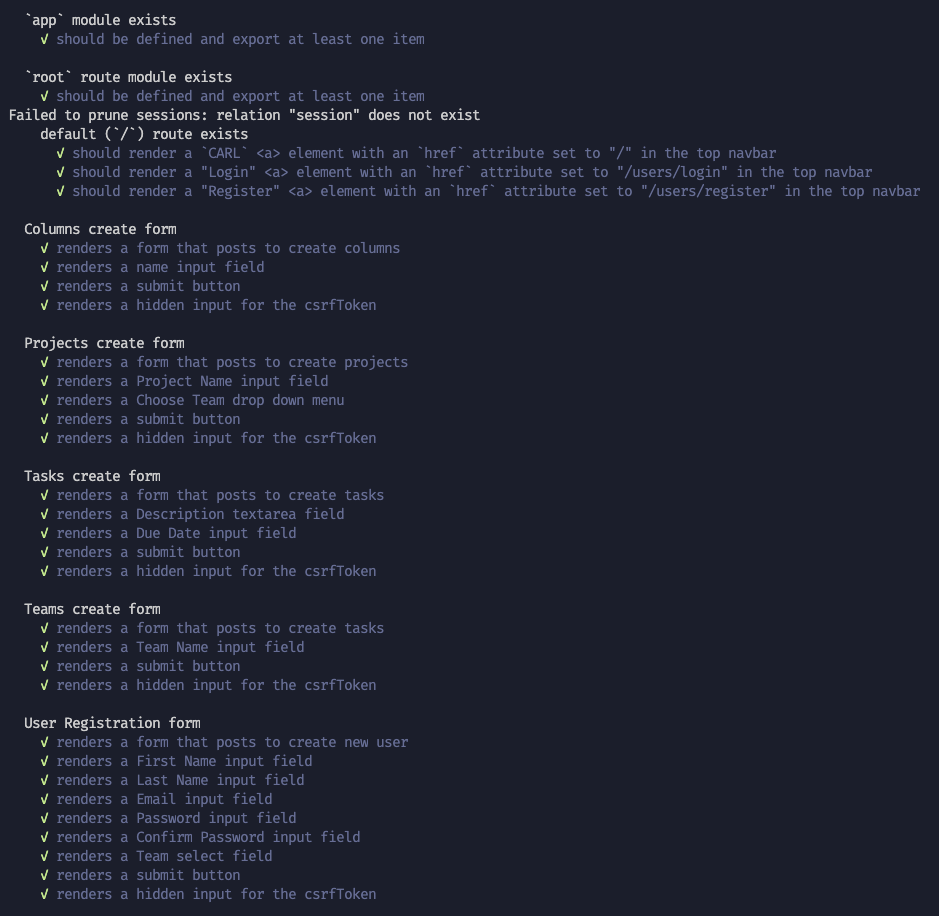
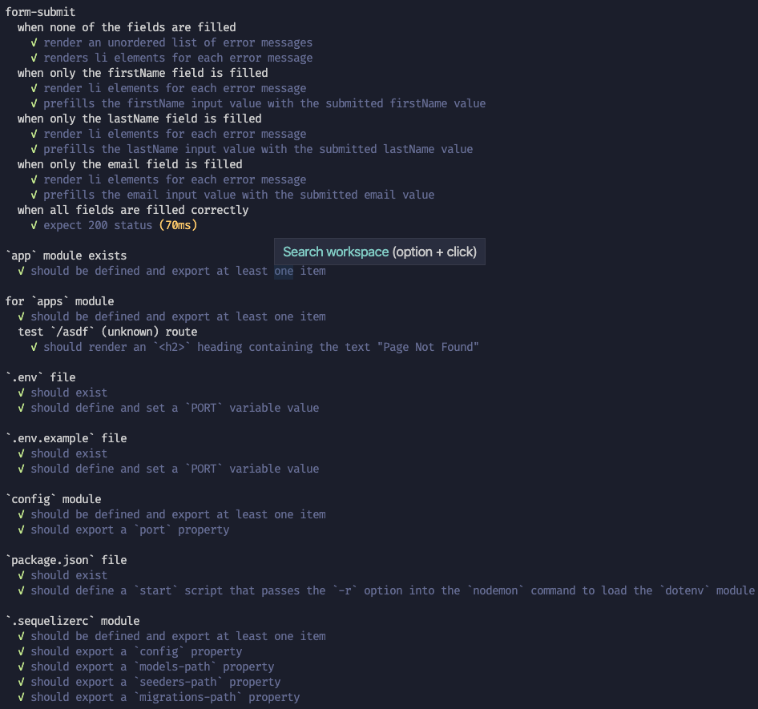
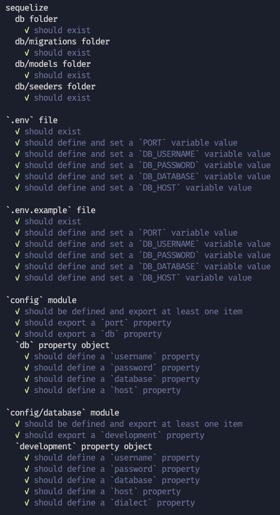
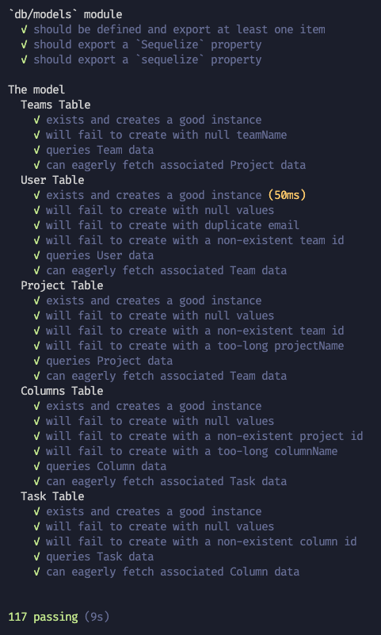

# Introduction
CARL is a work-flow application to help users organize their tasks.  
Tasks can be assigned to specific projects where they can be organized into categories.

- User **must** belong to a Team in order to be able to create projects and assign tasks

# Live Link

[C.A.R.L Work-flow Manager](https://hidden-fortress-08833.herokuapp.com/)

# Technologies

- Database management
	- Sequelize ORM
	- Postgres
- Front-end development
	- React
	- AJAX
	- DOM manipulation
	- CSS
	- Bootstrap
- Back-end development
	- Express.js
	- Express-session
	- Connect PG Simple
	- Csurf
	- Dotenv
	- Sequelize
	- Bcrypt
	- Unit tests to test:
		- Mocha
		- Chai
		- Cheerio
		- Moment
		- Sqlite3
		- Supertest
		- Umzug

# Features

- Professional landing page


- Drag-n-drop using React
```javascript
code snippet using react
and maybe gif
```

- Create and manage projects


- Create and manage tasks


- Unit tests
	- Models exists and creates good instances
	- Cannot create instance with null values
	- Able to query the data using sequelize
	- Can successfully eager load data from associated table
	- Correctly set:
		- environment variables
		- sequelizerc configs
	-  Correctly renders:
		- homepage
		- form elements with correct fields






# Technical Challenges

### Front-end
- front end challenges
### Back-end
- Unit Tests
	- decided to use customized functions to create model instances instead of using separate seed file for test environment
```javascript
async  function  testCreate(callback)  {
	let succeeded =  true;
	try  {
		await  callback();
	}  catch (e) {
		succeeded =  false;
	}
	return succeeded;
}

async  function  createModel(Model,  object)  {
	let instance =  null;
	await  testCreate(async  ()  =>  {
		instance =  await Model.create(object);
	});
	return instance;
}

const  passwordSample  =  'Abc1!'
function  userValues(o)  {
	return  {
		firstName:  str(20),
		lastName:  str(20),
		hashedPassword: passwordSample,
		email:  email(200),
		teamId:  Math.floor(Math.random() *  2),
		...o
	};
}
```
```javascript
it('exists and creates a good instance',  async  ()  =>  {
	const  {  models,  error  }  =  loadModel('User');
	if (stopTest(errorMessage || userError || error)) return;	
	const  {  User  }  = models;
	const  values  =  userValues({ teamId });
	succeeded =  await  createModel(User, values);
	if (!succeeded) return expect.fail(`Could not create an User with ${j(values)}`);
});
```


# Future Implementation

- Delete user
- Allow users to have many teams
- Allow a user to remove team members
- Update unit tests so that it can log in to pass the test statements
